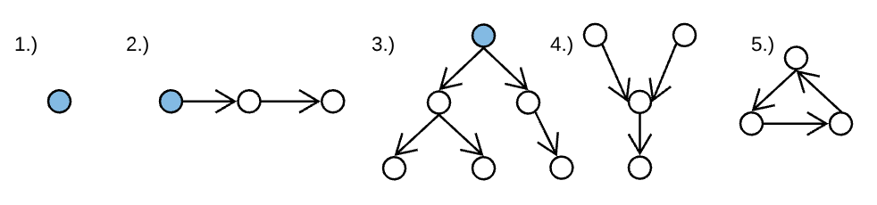
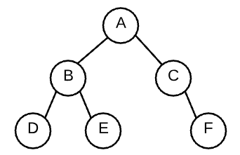

# Logarithms and Binary Trees
## Logarithms
A logarithm is the inverse of an exponent
```
log2(32) => how many times do we have to divide 32 by 2 to get 1?
32/2 => 16/2 => 8/2 => 4/2 => 2/2 => 1
log2(32) = 5
```
O(logn) has a curve that grows so slowly that it's virtually constant.
## Binary Trees
Graphs where each node has at most 2 children and no cycles.
### Graphs
A collection of `Nodes` and any `Edges` between them.

1. A graph, tree, and linked list
2. A graph, tree, and linked list
3. A graph, and a tree
4. A graph, but not a tree 'cause it has multiple parents
5. A graph, but not a tree 'cause it's cyclic

A tree is a graph that doesn't have any cycles.
The `Root` of the tree is usually depicted at the top of the tree.
### Binary Trees Continued
```javaScript
class Node {
  constructor(val) {
    this.val = val;
    this.left = null;
    this.right = null;
  }
}


let a = new Node(7);
let b = new Node(5);
let c = new Node(8);
let d = new Node(4);
let e = new Node(6);
let f = new Node(9);

a.left = b;
a.right = c;
b.left = d;
b.right = e;
c.right = f;
```

### Binary Search Tree (BST)
A tree where all nodes on the left are lower value than the current node and all nodes on the right are higher value than the current node.

```javaScript
function binaryTreeSearch(root, target) {
  if (!root) return false;
  if (root.value === target) return true;
  if (target < root.value) return binaryTreeSearch(root.left, target);
  return binaryTreeSearch(root.right, target)
}
```

Binary Search Trees have a time complexity of `O(logn)`
log2(number of nodes) = height
### Traversals
#### Depth First Traversal
- Pre-Order : Do the thing before recursing
- Recursively call the left subtree
- In-Order : Do the thing between recursing
- Recursively call the right subtree
- Post-Order : Do the thing afer recursing
```javaScript
function DFTRecursive(root) {
  // console.log(root)
  DFTRecursive(root.left);
  // console.log(root)
  DFTRecursive(root.right);
  // console.log(root)
}
```
DFT can be done with a stack.
```javaScript
function DFT(root) {
  let stack = [root]

  while (stack.length) {
    let curr = stack.pop()
    console.log(curr.val)
    stack.push(curr.left)
    stack.push(curr.right)
  }
}
```
#### Breadth First Traversal
- Put the starting node in a queue
- While the queue is not empty, repeat steps 3-4
- Dequeue a node and print it
- Put all of the node's children in the back of the queue
```javaScript
function BFT(root) {
  let queue = [root]

  while (queue.length) {
    let curr = queue.shift()
    console.log(curr.val)
    queue.push(curr.left)
    queue.push(curr.right)
  }
}
```
### Terminology
- Tree : Graphy without cycles
- Binary Tree : Tree where nodes have at most 2 children
- Root Node : The Ultimate Parent, this node can access every other node of the tree. Has no parent
- Branch Node : Node that has children
- Leaf Node : Node that doesn't have children
- Path : A series of nodes that can be traversed
- Edges : The connections between nodes
- Level : The number of edges between a node and the root
- Width : The number of nodes on a given level
- Height : The number of edges between the root and the lowest leaf