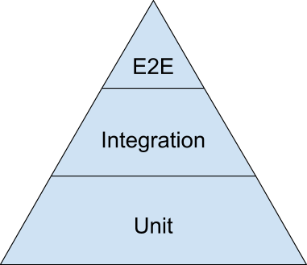
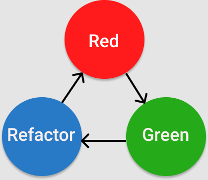

- Throw, catch, and create errors
- Identify and research common JavaScript error types
- Compare and contrast unit vs. integration vs. end-to-end testing
- Create, modify, and get to pass a suite of Mocha tests using the Chai assertion library
- Understand and apply Red-Green-Refactor cycle of Test-Driven Development (TDD)
- Understand given test specs and refer to and navigate the Mocha and Chai docs when encountering unknown syntax
- Construct an informed and high-quality question based off of an error message
- Create appropriate unit tests using the Single Responsibility Principle and DRY
-Plan for appropriate test coverage
- Identify and test for edge cases
- Interpret a test spec to determine a project's requirements
## JS Error Types
There are seven core errors in JS:
- `SyntaxError` : Error in the syntax
- `ReferenceError` : An invalid reference is made
- `TypeError` : A variable or parameter is not the valid type
- `RangeError` : A numerical variable or parameter is outside of its valid range
- `InternalError` : Internal JS engine
- `EvalError` : Global `eval` function
- `URIError` : When `encodeURI()` or `decodeURI()` are passed invalid parameters

We'll focus on the 3 most common:
### `SyntaxError`
Thrown when the JS engine attempts to parse code that does not conform to the syntax of the JS language. Includes missing `<>{}[]()` or misspelled words.
```javaScript
// function is misspelt(sp?) so we get a SyntaxError
functio broken() {
  console.log("I'm broken");
}
```
```javaScript
function broken() {
  console.log("I'm broken");
// we have an extra curly boi here so we get a SyntaxError
}}
```
### `ReferenceError`
Thrown when we try to use a variable that doesn't exist or hasn't been declared yet.
```javaScript
function CREAM() {
  const money = '$$$';
  // variable 'monie' doesn't exist so we get a ReferenceError
  console.log(monie);
}

CREAM()
```
```javaScript
function CREAM() {
  const money = '$$$';
  console.log(money);
}

// variable 'money' is out of scope so we get a ReferenceError
console.log(money)
```
### `TypeError`
A few reasons `TypeError` is commonly thrown:
- An operationi can't be performed because the operand is the wrong type.
- You're attempting to modify a value that can't be modded.
```javaScript
let dog = 'hello';

// dog is not a function, so we get a TypeError
dog()
```
```javaScript
const dog = 'hello';

// dog is const, attempting reassignment gives a TypeError
dog = 'goodbye'
```
### Looking up Errors
If you run into an error you don't know

- In the error look for a line that looks similar to this :
```shell
// this is the stacktrace
// file.js is the file:13 is the line number:12 is the char
at something (/file/path/to/current/file.js:13:12)
```
- Check MDN for the function or method you're running. 
- Check MDN for the Error Type
## Error Handling
### Custom Errors
```javaScript
let myError = new Error(message, fileName, lineNumber);
// or
let newError = Error(message);
```
### Throwing Errors
```JavaScript
function giveMeNumber(num) {
  if (typeof num !== 'number') {
    // Yes, we can throw JS errors too
    throw new TypeError('Give Me Number');
  } else {
    return 'yupp'
  }
}

giveMeNumber('aye')
```
Errors will stop your code from continuing, we can stop this by using `try...catch` blocks:
```javaScript
function giveMeNumber(num) {
  if (typeof num !== 'number') {
    // Yes, we can throw JS errors too
    throw new TypeError('Give Me Number');
  } else {
    return 'yupp'
  }
}

try{
  giveMeNumber('aye')
} catch (error) {
  console.error(`Gon' Fishin'...\nCaught: ${error.name}: ${error.message}`);
}

console.log('We keep going!');
```
Many `SyntaxErrors` can't be caught with a `try...catch` :(

#### ...finally
This block will run whether or not you throw an error: 
```javaScript
function giveMeNumber(num) {
  if (typeof num !== 'number') {
    // Yes, we can throw JS errors too
    throw new TypeError('Give Me Number');
  } else {
    return 'yupp'
  }
}

try{
  giveMeNumber('aye')
} catch (error) {
  console.error(`Gon' Fishin'...\nCaught: ${error.name}: ${error.message}`);
} finally {
  console.log('This always runs!');
}

console.log('We keep going!');
```
## Testing Pyramid
### Why Test?
- Make sure your code works
- Increase Flexibility and Confidence

When we know what we're testing for, we know exactly what the end goal of the code we're writing. And if you break something, the tests will tell you!
- Make collaboration easier

Specs allow teams to have confidence that each module performs a specific task and reduces the need for expensive coordination. The specs themselves become an effective form of communication.
- Produce Documentation

If the tests are written well, the tests can serve as documentation for the codebase. Need to know what such and such module does? Check out the specs. This is related to easing collaboration.
## Testing Pyramid

- **Unit Tests** : Tests each piece of code on it's own.
- **Integration Tests** : Make sure pieces of code work together.
- **End-to-End Tests (E2E)** : Make sure the whole applicatioin works.

### Test-Driven Development (TDD)
The practice of writing tests before writing code. Why?
- Ensures the code written works
  - Code is written to pass specs
  - Code with pre-written specs allows other devs to add and test new code without breaking other code.
- Only required code is written
  - When you have tests it helps reduce un-needed functionality.
  - TDD and YAGNI ("you ain't gonna need it") got hand-in-hand.
- Enforces modularity
  - You're forced to think about your app in small, testable chunks, so you write each chunk to be modular
- Better understanding of what code should be doing
  - Ensures you know what the piece of code for a spec is trying to do
### Three Steps of TTD : Red, Green, Refactor


**Red** : Write the tests and watch them fail (failing tests are red). This ensures no false positives.

**Green** : Write the minimum amount of code to ensure the tests pass (passing tests are green).

**Refactor** : Refactor your code, make it easy to maintain and read!

## Unit Testing with Mocha and Chai
- `npm init -y` : initializes npm on your project
- `npm install mocha chai` : will install the npm packages for mocha and chai
  - NOTE: you may run into some issues with versioning, make sure the versions listed in you `package.json` are the same version as the ones your told to install.
- create a directory call `test`, mocha expects this.
- put any test files such as `base-test.js` in the test directory
- in `base-test.js` import required code
```javaScript
const { expect } = require('chai');
const User = require('../user.js');
```
- run `mocha` to test that everything fails.
- write your tests