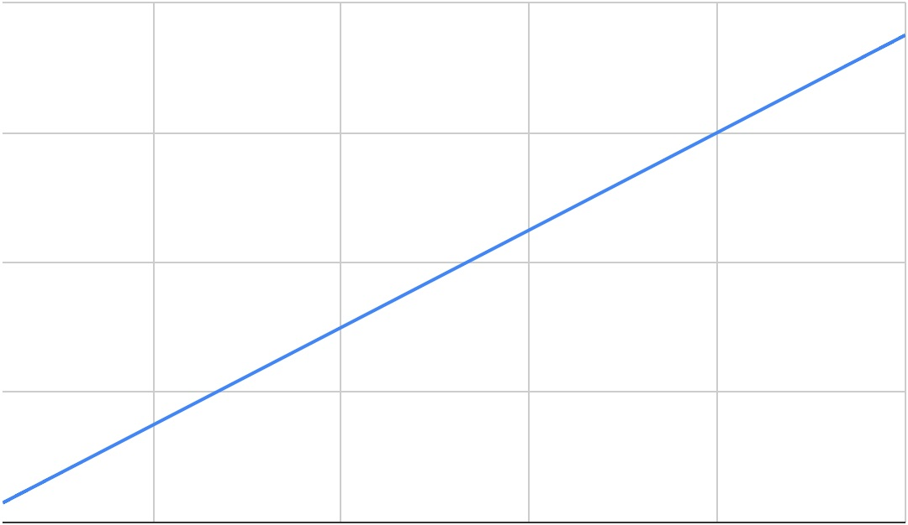
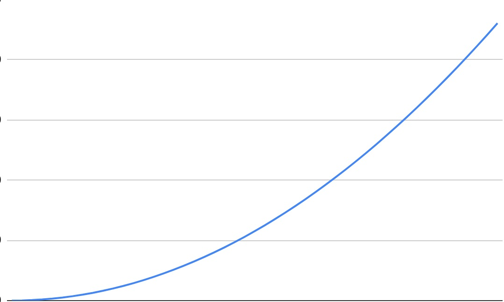
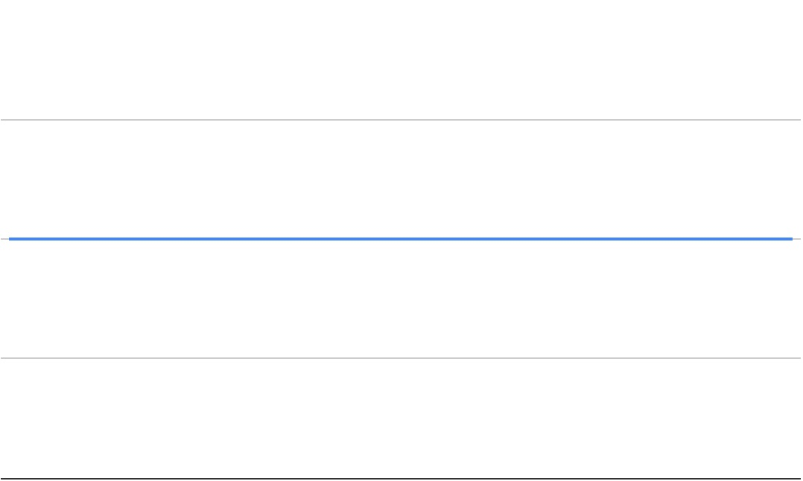

# Big-O
Used to describe the rate of growth of a function, determined via `complexity analysis`.

The "O" in big-O stands for 'order' meaning it's not concerned with exact values instead describing the shape of the growth curve.

Only concerned with very large values. Computers are fast so anything under 50_000 operations feel instantaneous.
```javaScript
function addTwoNums(num1, num2) {
  let total = 0;

  for (let i = 0 ; i < num1 ; i++) {
    total += 1;
  }
  for (let i = 0 ; i < num2 ; i++) {
    total += 1;
  }

  return total;
}

let startTime = Date.now();
addTwoNums(1234, 5678);
let endTime = Date.now();

console.log(`Runtime: ${endTime - startTime}ms`)
```
With big-O, we ignore coefficients and insignificant factors.
- 3n-1 => 3n => `n`
- 15n<sup>2</sup> + 3/2 => 15n<sup>2</sup> => `n<sup>2</sup>`
- 18 => 18 * 1 => `1`
## Best Case, Worst Case, Average Case
Sometimes performance is based on some amount of luck.
```javaScript
function arraySearch(arr, target) {
  for (let i = 0 ; i < arr.length ; i++) {
    if (arr[i] === target) return true;
  }

  return false;
}
```
- If the target is the first value, that's our best case.
  - Best Case is big-Ω (omega)
- If the target is in the middle, that's our average case.
  - Average Case is big-Θ (theta)
- If the target isn't in the array, that's our worst case.
  - Worst Case is big-O

Generally, we use big-O to describe the most common case.

It's good to think of big-O as a way to describe code performance to another human, rather than as math.

## Time Complexity
### Linear Growth O(n)

Basically, if you're iterating, it's O(n).
```javaScript
// `O(n)`
function someFunction(arr) {
  for(let i = 0; i<arr.length; i++) {
    console.log(i);
  }
}
```
```javaScript
// O(2n) => `O(n)`
function someFunction(arr) {
  for(let i = 0; i<arr.length; i++) {
    console.log(i);
  }

  for(let i = 0; i<arr.length; i++) {
    console.log(i);
  }
}
```
```javaScript
// O(n + 1) => `O(n)`
function someFunction(arr) {
  let i = 0;

  while (i < arr.length) {
    console.log(i);
    i++;
  }
}
```
### Quadratic Growth O(n<sup>2</sup>)

Basically, if there are nested loops, it's O(n<sup>x</sup>).
```javaScript
// O(n + n^2) => `O(n^2)`
function someFunction(arr) {
  for(let i = 0; i<arr.length; i++) {
    console.log(i);
  }
  for(let i = 0; i<arr.length; i++) {
    for(let i = 0; i<arr.length; i++) {
      console.log(i);
    }
  }
}
```
```javaScript
// `O(n^2)`
function someFunction(arr) {
  for(let i = 0; i<arr.length; i++) {
    for(let i = 0; i<arr.length; i++) {
      console.log(i);
    }
  }
}
```
#### Polynomial Growth O(n<sup>x</sup>)
This is when the number of nesting is greater than two levels deep.
### Constant Growth O(1)

Most math and logic is constant. Same with creating and assigning variables.
```javaScript
// O(2) => `O(1)`
function someFunction(arr) {
  return arr[0] + arr[i]
}
```
```javaScript
// `O(1)`
function someFunction(arr) {
  return 65461 - 16516;
}
```

## Space Complexity
### Linear Growth O(n)

Basically, if you're iterating, it's O(n).
If you're using only primitives, each one takes up the same space in memory.
```javaScript
// O(n + 1) => `O(n)`
function someFunction(num) {
  let nums = []; // nums is an array (O(n));
  for (let i = 0 ; i < num ; i++) { // i is an int (O(1))
      nums.push(i);
  }
  return nums;
}
```
### Quadratic Growth O(n<sup>2</sup>)

```javaScript
// O(n*n + 2) => O(n*n) => `O(n^2)`
function someFunction(num) {
  let pairs = []; // this is an array (O(n)) of arrays (O(n))
  for (let i = 0 ; i < n ; i++) { // i is an int (O(1))
      for (let j = 0 ; j < n ; j++) { // j is an int (O(1))
          pairs.push([i, j]);
      }
  }
  return pairs;
}
```
### Constant Growth O(1)

If you're using only primitives, each one takes up the same space in memory.
```javaScript
// O(2) => `O(1)`
function someFunction(num) {
  let total = 0; // total is an int (O(1)) 
  for (let i = 0; i < num; i++) { // i is an int (O(1)) 
    total += i;
  }
  return total;
}
```
```javaScript
// O(2) => `O(1)`
function someFunction(str) {
  let total = ""; // total is a string (O(1)) 
  for (let i = 0; i < str.length; i++) { // i is an int (O(1)) 
    total += str[i] + str[i];
  }
  return total;
}
```

### In-Place Operations
In-Place Operations don't create new data structures but modify existing ones.

As a result they have better space efficiency but they mutate the original array. Only use this once you fully understand what behavior is desired.
```javaScript
// Out of Place
// O(n + 1) => `O(n)`
function someFunction(arr) {
  let res = []; // res is an array O(n)
  for (let i = 0; i < arr.length; i++) { //i is an int O(1)
    res.push(arr[i]);
  }
  return res;
}
```
```javaScript
// In Place
// `O(1)`
function someFunction(arr) {
  for (let i = 0; i < arr.length; i++) { //i is an int O(1)
    arr[i] = arr[i] + 1;
  }
  return arr;
}

```