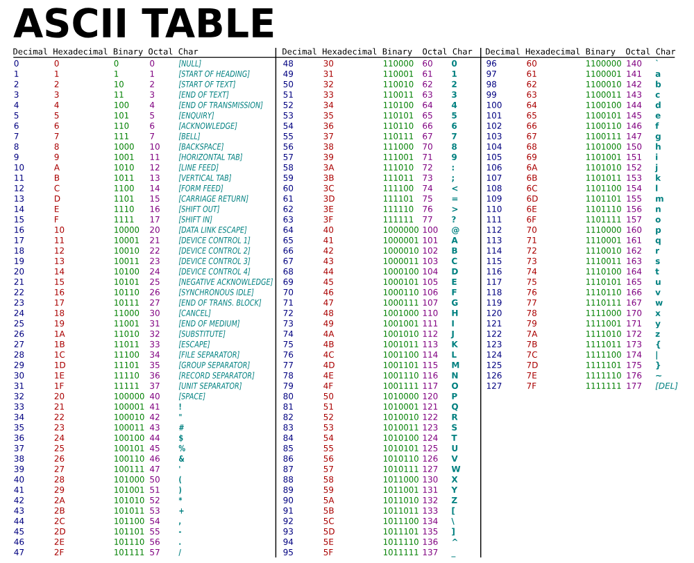

# Intro to Number Bases : Binary, Decimal and Hexadecimal
## Base 10 : Decimal
This is the number system we're all very acquainted with.

We count using numbers 0 - 9.
## Base 2 : Binary (0b || 0B)
In this system we only use the numbers 1 and 0.
```
0000 : 0   0101 : 5
0001 : 1   0110 : 6
0010 : 2   0111 : 7
0011 : 3   1000 : 8
0100 : 4   1000 : 8
```
### Binary to Decimal
For each digit, starting at the right,
n = it's position in the number
B = the base
v = value

Base to Decimal : __B<sup>n</sup> * v__
```
1010
1010<   2^0 * 0 => 1 * 0 => 0
101<0   2^1 * 1 => 2 * 1 => 2 + 0
10<10   2^2 * 0 => 4 * 0 => 0 + 2 + 0
1<010   2^3 * 1 => 8 * 1 => 8 + 0 + 2 + 0 => 10
```
### Decimal to Binary
Divide the decimal number by 2, keeping track of remainders.
```
365
365/2 => 182r1
182/2 => 91 r0
91 /2 => 45 r1
45 /2 => 22 r1
22 /2 => 11 r0
11 /2 => 5  r1
5  /2 => 2  r1
2  /2 => 1  r0
1  /2 => 0  r1
0b101101101
```
## Base 16 : Hexadecimal ( 0x || 0X )
In this system we use numbers from 1-F, that's base-16:

0 1 2 3 4 5 6 7 8 9 A B C D E F

Hexadecimal is often used as shorthand for binary: one hex digit can represent 4 bits
```
0  = 0b0000 = 0x0
1  = 0b0001 = 0x1
2  = 0b0010 = 0x2
3  = 0b0011 = 0x3
4  = 0b0100 = 0x4
5  = 0b0101 = 0x5
6  = 0b0110 = 0x6
7  = 0b0111 = 0x7
8  = 0b1000 = 0x8
9  = 0b1001 = 0x9
10 = 0b1010 = 0xA
11 = 0b1011 = 0xB
12 = 0b1100 = 0xC
13 = 0b1101 = 0xD
14 = 0b1110 = 0xE
15 = 0b1111 = 0xF
```
### Hexadecimal to Decimal
```
0xF23C
0xF23C< 16^0 * c => 1    * 12 => 12
0xF23<C 16^1 * 3 => 16   * 3  => 48 + 12
0xF2<3C 16^2 * 2 => 256  * 2  => 512 + 48 + 12
0xF<23C 16^3 * f => 4096 * 15 => 61,440 + 512 + 48 + 12 => 62,012
```
### Decimal to Hexadecimal
```
62012
62012/16 => 3875r12 => C
3875 /16 => 242 r3
242  /16 => 15  r2
15   /16 => 0   r15 => F
0xF23C
```

## Bits, Bytes & Beyond
**Bi**nary Digi**ts** are called bits, there are 8 bits in a byte.
Then we can apply metric prefixes to dictate greater numbers
```
kilo  => 1,000 bytes
mega  => 1,000,000 bytes
giga  => 1,000,000,000 bytes
tera  => 1,000,000,000,000 bytes
peta  => 1,000,000,000,000,000 bytes
exa   => 1,000,000,000,000,000,000 bytes
zetta => 1,000,000,000,000,000,000,000 bytes
yotta => 1,000,000,000,000,000,000,000,000 bytes
```
## Letters in Binary
We represent letters in binary by using ASCII (American Standard Code for Informationi Interchange)


```
'ABC'                         (plain text)
 1000001  1000010  1000011    (3 7-bit strings)
01000001 01000010 01000011    (3 8-bit strings)
0100 0001 0100 0010 0100 0011 (in memory)
```
### Built-in Conversions in JS
`String.fromCharCode()` : Get character from Decimal Code on ASCII table
```javaScript
String.fromCharCode(65); // A
String.fromCharCode(66); // B
String.fromCharCode(67); // C
```
`String.prototype.charCodeAt(index)` : Return Decimal Code for character at index in string
```javaScript
const str = 'ABC';
str.charCodeAt(0); // 65
str.charCodeAt(1); // 66
str.charCodeAt(2); // 67
```
`parseInt(string, base)` : convert string from base-x to decimal
```javaScript
parseInt('a1', 16);  // 161
parseInt(`1011`, 2); // 11
```
`toString(base)` : convert decimal to base-x string
```javaScript
const decimal = parseInt('a1', 16);       // 161
const hexadecimal = decimal.toString(16); // 'a1'
const binary = decimal.toString(2)        // '10100001'
```